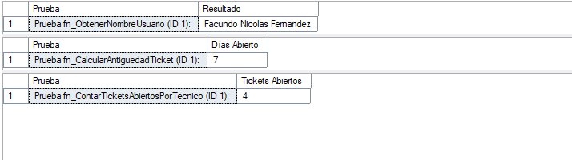

## Proyecto de Estudio: Diseño e Implementación de una Base de Datos para la Gestión de Tickets.

### Universidad Nacional del Nordeste

### Facultad de Ciencias Exactas y Naturales y Agrimensura

### Asignatura: Bases de Datos I

## Profesores:

Darío O. Villegas  
Juan José Cuzziol  
Walter O. Vallejos  
Numa Badaracco

## Autores:

Cabrera, Wilson Alexis.  
Fernandez, Facundo Nicolás.  
Mumbach, Juan Ignacio.  
Pavon, Máximo David Octavio.

## Año: 2025

---

# 📑 ÍNDICE

- [CAPÍTULO I: INTRODUCCIÓN](#capítulo-i-introducción)
  - [a) Tema](#a-tema)
  - [b) Definición o planteamiento del Problema](#b-definición-o-planteamiento-del-problema)
  - [c) Objetivo del Trabajo Práctico](#c-objetivo-del-trabajo-práctico)
    - [i. Preguntas Generales](#i-preguntas-generales)
    - [ii. Preguntas Específicas](#ii-preguntas-específicas)
    - [iii. Objetivos Generales](#iii-objetivos-generales)
    - [iv. Objetivos Específicos](#iv-objetivos-específicos)
  - [d) Descripción del Sistema](#d-descripción-del-sistema)
  - [e) Alcance](#e-alcance)
- [CAPÍTULO II: MARCO CONCEPTUAL O REFERENCIAL](#capítulo-ii-marco-conceptual-o-referencial)
  - [Tema 1: Procedimientos Almacenados (SPs) y Funciones (FN)](#tema-1-procedimientos-almacenados-sps-y-funciones-fn)
  - [Tema 2: Índices y Optimización](#tema-2-índices-y-optimización)
  - [Tema 3: Transacciones](#tema-3-transacciones)
  - [Tema 4: Permisos](#tema-4-permisos)
- [CAPÍTULO III: METODOLOGÍA SEGUIDA](#capítulo-iii-metodología-seguida)
  - [a) Cómo se realizó el Trabajo Práctico](#a-como-se-realizo-el-trabajo-practico)
  - [b) Herramientas](#b-Herramientas-Instrumentos-y-procedimientos)
- [CAPÍTULO IV: DESARROLLO DEL TEMA / PRESENTACIÓN DE RESULTADOS](#capítulo-iv-desarrollo-del-tema--presentación-de-resultados)
  - [a) Diagrama de Modelo Relacional](#a-diagrama-de-modelo-relacional)
  - [b) Diccionario de Datos](#b-diccionario-de-datos)
  - [c) Implementación de Tareas Técnicas](#c-implementación-de-tareas-técnicas)
- [CAPÍTULO V: CONCLUSIONES](#capítulo-v-conclusiones)
- [CAPÍTULO VI: BIBLIOGRAFÍA DE CONSULTA](#capítulo-vi-bibliografía-de-consulta)
  - [Tema 01](#tema-01---funciones-y-procedimientos-almacenados)
  - [Tema 03](#tema-03---manejo-de-transacciones-y-transacciones-anidadas)
  - [Tema 04](#tema-04---manejo-de-permisos-a-nivel-de-usuarios-de-base-de-datos)

---

# CAPÍTULO I: INTRODUCCIÓN

## a) Tema

Diseño e Implementación de una Base de Datos Relacional para un Sistema de Gestión de Tickets de Soporte Técnico.

## b) Definición o planteamiento del Problema

En la actualidad, las empresas dependen en gran medida de la tecnología para el desarrollo de sus operaciones. Esto genera la necesidad de contar con un área de soporte técnico capaz de atender incidencias de hardware, software, redes o servicios internos de manera rápida y ordenada.

El uso de sistemas o software no dedicado a este objetivo, u organizaciones que registran estos incidentes de forma manual (a través de correos electrónicos, llamadas telefónicas o incluso mensajes informales) provoca desorganización, pérdida de información, retrasos en la atención y dificultad para medir la eficiencia del área de soporte.

## c) Objetivo del Trabajo Práctico

### i. Preguntas Generales

¿Cómo podemos optimizar la gestión de incidencias, el seguimiento de técnicos y la trazabilidad de las soluciones en un área de soporte?

### ii. Preguntas Específicas

¿Cómo podemos registrar una incidencia de forma unificada?

¿Cómo asignamos un técnico responsable a un ticket?

¿Cómo evitamos que un ticket quede "olvidado" sin resolver?

¿Cómo puede un usuario consultar el estado de sus tickets?

¿Cómo medimos el tiempo de respuesta y la eficiencia de los técnicos?

### iii. Objetivos Generales

Dar solución a la problemática de la falta de un sistema centralizado para la gestión de incidencias, mejorando la trazabilidad y los tiempos de respuesta del área de soporte.

## iv. Objetivos Específicos

Centralizar la creación de tickets de soporte.

Optimizar la asignación de tickets a técnicos según su especialidad.

Permitir un seguimiento integral de cada incidencia a través de un historial.

Obtener métricas de desempeño que apoyen la toma de decisiones.

## d) Descripción del Sistema

El sistema de gestión de tickets permitirá a los usuarios (empleados o clientes externos) generar solicitudes de asistencia (tickets). Estos serán asignados a técnicos responsables y categorizados según su tipo y prioridad.

El sistema cuenta con perfiles de Usuario (quien crea el ticket) y Técnico (quien lo resuelve). Cada técnico puede tener una o más Especialidades, y cada ticket se asigna a una Categoría de Problema. La tabla central Tickets vincula al usuario, al técnico y la categoría.

La tabla Historial es fundamental, ya que documenta cada acción (creación, comentario, cambio de estado, asignación) realizada sobre un ticket, garantizando una trazabilidad completa desde que se abre hasta que se cierra.

## e) Alcance

El alcance del proyecto se limita al diseño e implementación de la base de datos relacional. Incluye el script de creación de tablas, el diccionario de datos y la investigación de conceptos aplicados (Roles, SPs, Índices, JSON).

---

# CAPÍTULO II: MARCO CONCEPTUAL O REFERENCIAL

A continuación, se detallan los conceptos teóricos fundamentales de SQL Server que se han investigado y aplicado directamente en el diseño, optimización y seguridad de la base de datos del Sistema de Tickets.

## TEMA 1: Procedimientos Almacenados (SPs) y Funciones (FN)

Para encapsular la lógica de negocio, centralizar las operaciones y controlar la manipulación de datos, se utiliza lógica almacenada dentro de la base de datos.

### Procedimientos Almacenados (SPs)

Son conjuntos de instrucciones SQL (SELECT, INSERT, UPDATE, DELETE) que se compilan y ejecutan como una única unidad. Son fundamentales para la seguridad y la integridad.

### Aplicación en el Sistema de Tickets:

- **`sp_InsertarTicket:`** Centraliza la lógica de creación de un ticket, ejecutando el INSERT en Tickets y el INSERT en Historial de forma atómica. Esto asegura que ambas acciones se realicen o ninguna se realice (Atomicidad).

- **`sp_ModificarEstadoTicket:`** Permite cambiar el estado de un ticket y opcionalmente asignarlo a un técnico, registrando siempre el cambio en Historial.

- **`Seguridad:`** Permite que un usuario limitado tenga permiso de EXECUTE sobre el SP, sin tener permisos directos de INSERT sobre las tablas subyacentes.

### Funciones Almacenadas (FN)

Son rutinas que siempre devuelven un valor (escalar o tabla) y, por regla general, no pueden modificar datos (no pueden ejecutar DML como INSERT/UPDATE).

### Aplicación en el Sistema de Tickets:

- **`fn_ContarTicketsActivosPorTecnico:`** Permite a un reporte calcular rápidamente cuántos tickets abiertos o en proceso tiene un técnico, sin la complejidad de escribir la consulta de agregación en la aplicación. Son ideales para dashboards o reportes sencillos.

- **`fn_ObtenerPrioridadDeTicket:`** Se utiliza para devolver la prioridad de un ticket, permitiendo un uso directo en sentencias SELECT o WHERE.

## TEMA 2: Índices y Optimización

Un sistema de tickets puede crecer a más de un millón de registros. Los índices son la principal herramienta para garantizar que el sistema mantenga el rendimiento a pesar del volumen de datos.

### Concepto de Plan de Ejecución

El motor de SQL evalúa el costo de ejecutar una consulta y genera un Plan de Ejecución. Nuestro objetivo es que el costo de búsqueda sea mínimo, forzando un Index Seek en lugar de un costoso Table Scan (escaneo de toda la tabla).

### Índices No Agrupados (Non-Clustered)

Son estructuras separadas que contienen un puntero a la fila de datos. Son cruciales para las búsquedas.

### Aplicación en el Sistema de Tickets:

- **`Optimización de Búsqueda por Tiempo:`** Se creó un índice no agrupado en la columna fecha_creacion de la tabla Ticket.

- **`Prueba de Rendimiento:`** Al buscar tickets en un rango de fechas (WHERE fecha_creacion BETWEEN 'fecha1' AND 'fecha2'), el índice permite al motor de SQL ir directamente a los datos relevantes, reduciendo el costo de la consulta del 99% a una fracción mínima.

## TEMA 3: Transacciones

Las transacciones aseguran que las operaciones complejas mantengan la integridad y la fiabilidad de los datos bajo el principio de Atomicidad (ACID).

### Atomicidad y Control de Fallos

La Atomicidad garantiza que un conjunto de operaciones DML (UPDATE, INSERT) se realicen completamente o se reviertan completamente.

### Aplicación en el Sistema de Tickets:

- **`Prueba de Éxito (COMMIT`** Se demuestra que la asignación de un ticket (UPDATE Ticket) y el registro de esa acción (INSERT Historial) se confirman juntos (COMMIT), asegurando la Durabilidad.

- **`Prueba de Fallo (ROLLBACK):`** Se fuerza un error (ej., violando la llave foránea con un id_usuario = 999). El bloque CATCH ejecuta un ROLLBACK TRANSACTION, que anula todos los pasos intermedios exitosos, evitando que la base de datos quede en un estado inconsistente.

## TEMA 4: Permisos

La seguridad se implementa para controlar el acceso a los datos. El modelo se basa en el Principio de Mínimo Privilegio.

### Permisos y Roles

- **`Usuario Limitado (UsuarioFinal_Lectura):`** Se demuestra que este usuario falla al intentar un INSERT directo en la tabla Ticket (protegiendo los datos).

- **`Permiso de EXECUTE:`** Se le otorga a este mismo usuario el permiso EXECUTE sobre el SP sp_CrearNuevoTicket.

- **`Prueba Central:`** El usuario puede insertar datos de forma exitosa usando el SP, aunque no tiene permiso directo de INSERT sobre la tabla. Esto demuestra que la lógica de negocio se ejecuta de forma segura y controlada, sin comprometer la tabla subyacente.

---

# CAPÍTULO III: METODOLOGÍA SEGUIDA

## a) Como se realizo el Trabajo Practico

El presente trabajo práctico se desarrolló de manera grupal, fomentando la colaboración y el trabajo coordinado entre los integrantes del equipo.
Para la gestión del proyecto y el trabajo conjunto se utilizaron herramientas colaborativas que facilitaron la comunicación, el control de versiones y la organización de los archivos.

Se empleó GitHub como plataforma principal para el control de versiones y gestión del código, lo que permitió la integración de los aportes de cada integrante y el seguimiento de los cambios realizados en el diseño de la base de datos.
Además, se utilizó Google Drive para el almacenamiento y organización de la documentación, incluyendo reportes, diagramas y avances del proyecto, garantizando la accesibilidad y sincronización de los materiales entre todos los miembros del grupo.

El trabajo se realizó siguiendo una metodología iterativa, donde se fueron desarrollando y ajustando los modelos de datos conforme se analizaban las necesidades del sistema de gestión de tickets. Cada etapa fue validada en conjunto, asegurando la coherencia entre el diseño conceptual, lógico y físico de la base de datos.

## b) Herramientas (Instrumentos y procedimientos)

Para el desarrollo del sistema de gestión de tickets, se utilizaron diversas herramientas que facilitaron tanto el diseño conceptual y lógico como la implementación física de la base de datos. Entre las principales se destacan:

ERDPlus: Utilizado para la creación del modelo Entidad–Relación (E–R), permitiendo representar de forma clara las entidades, atributos y relaciones necesarias para el sistema.

Draw.io: Empleado para la elaboración de diagramas complementarios, tales como diagramas de flujo y casos de uso, que ayudaron a comprender los procesos de registro, asignación y resolución de tickets.

SQL Server: Sistema de gestión de base de datos elegido para la implementación del modelo relacional. En esta herramienta se crearon las tablas, claves primarias y foráneas, así como las restricciones necesarias para garantizar la integridad de los datos.

Diagrama Entidad–Relación (DER): Representó de manera visual las entidades del sistema (usuarios, técnicos, tickets, historial, entre otras) y sus respectivas relaciones.

Modelo Relacional: Permitió traducir el modelo conceptual al nivel lógico mediante la definición de las tablas y sus campos con sus respectivos tipos de datos.

Diccionario de Datos: Documentó cada campo, tipo de dato, clave y descripción de todas las tablas que conforman la base de datos, sirviendo como guía técnica para su correcta implementación y mantenimiento.

---

# CAPÍTULO IV: DESARROLLO DEL TEMA / PRESENTACIÓN DE RESULTADOS

En este capítulo, se presentará de forma detallada, los datos e información que se fueron recopilando para comprender, analizar el caso de estudio y conseguir los resultados esperados.

Se emplearon diversas herramientas para lograr el diseño y la gestión de la información de la base de datos. Algunas de estas herramientas nos permitieron representar gráficamente las entidades, tablas y las relaciones entre las mismas, identificando de manera clara y fácilmente los datos, su estructura y comportamiento.

## a) Diagrama de Modelo Relacional

Un Diagrama de Modelo Relacional también conocido como Diagrama Entidad-Relación (ER), es una representación gráfica que muestra cómo interactúan las entidades dentro de una base de datos. Este tipo de diagrama ayuda a visualizar las relaciones entre diferentes elementos clave.

La siguiente imagen representa el Modelo Relacional del sistema de gestión de tickets

## b) Diccionario de Datos

Diccionario de Datos
A continuación, se detalla el diccionario de datos que define la estructura de la base de datos relacional para el sistema de gestión de tickets. El diseño incluye columnas de auditoría (date_create, user_create) para rastrear la creación de registros y una columna activo para implementar el borrado lógico (soft delete), preservando la integridad histórica de los datos.

### Tabla: Usuario

Almacena la información de los usuarios que pueden crear tickets.

| Campo       | Tipo de Dato | Longitud | Nulable | Clave | Descripción                                         |
| ----------- | ------------ | -------- | ------- | ----- | --------------------------------------------------- |
| id_usuario  | INT          | 10       | NO      | PK    | Identificador único del usuario(Aut).               |
| nombre      | VARCHAR      | 255      | NO      |       | Nombre completo del usuario.                        |
| correo      | VARCHAR      | 255      | NO      | UQ    | Dirección de correo elect del usuario (Único).      |
| telefono    | VARCHAR      | 20       | SÍ      |       | Número de teléfono del usuario.                     |
| empresa     | VARCHAR      | 255      | SÍ      |       | Nombre de la empresa a la que pertenece el usuario. |
| date_create | DATETIME     |          | NO      |       | Auditoría: Fecha y hora de creación del registro.   |
| user_create | VARCHAR      | 100      | NO      |       | Auditoría: Usuario de BD que creó el registro.      |
| activo      | BIT          |          | NO      |       | Borrado Lógico: 1 (Activo) o 0 (Inactivo).          |

### Tabla: Tecnico

Almacena la información de los técnicos que resuelven los tickets.

| Campo       | Tipo de Dato | Longitud | Nulable | Clave | Descripción                                        |
| ----------- | ------------ | -------- | ------- | ----- | -------------------------------------------------- |
| id_tecnico  | INT          | 10       | NO      | PK    | Identificador único del técnico (Autoincremental). |
| nombre      | VARCHAR      | 255      | NO      | UQ    | Nombre completo del técnico (Único).               |
| correo      | VARCHAR      | 255      | NO      | O     | Nombre completo del técnico.                       |
| date_create | DATETIME     |          | NO      |       | Auditoría: Fecha y hora de creación del registro.  |
| user_create | VARCHAR      | 100      | NO      |       | Auditoría: Usuario de BD que creó el registro.     |
| activo      | BIT          |          | NO      |       | Borrado Lógico: 1 (Activo) o 0 (Inactivo).         |

### Tabla: Especialidad

Contiene las diferentes especialidades en las que un técnico puede estar calificado.

| Campo             | Tipo de Dato | Longitud | Nulable | Clave | Descripción                                      |
| ----------------- | ------------ | -------- | ------- | ----- | ------------------------------------------------ |
| id_especialidad   | INT          | 10       | NO      | PK    | Identificador único de la especialidad(Autoi).   |
| tipo_especialidad | VARCHAR      | 100      | NO      | UQ    | Nombre o descripción de la especialidad (Único). |
| date_create       | DATETIME     |          | NO      |       | Auditoría:Fecha y hora de creación del registro. |
| user_create       | VARCHAR      | 100      | NO      |       | Auditoría: Usuario de BD que creó el registro.   |
| activo            | BIT          |          | NO      |       | Borrado Lógico: 1 (Activo) o 0 (Inactivo).       |

### Tabla: Tecnico_Especialidad

Tabla intermedia para la relación N:M entre Tecnico y Especialidad.

| Campo           | Tipo de Dato | Longitud | Nulable | Clave  | Descripción                                                       |
| --------------- | ------------ | -------- | ------- | ------ | ----------------------------------------------------------------- |
| id_tecnico      | INT          | 10       | NO      | PK, FK | Identificador del técnico (clave foránea de Tecnico).             |
| id_especialidad | INT          | 10       | NO      | PK, FK | Identificador de la especialidad (clave foránea de Especialidad). |
| date_create     | DATETIME     |          | NO      |        | Auditoría: Fecha en que se asignó la especialidad.                |
| user_create     | VARCHAR      | 100      | NO      |        | Auditoría: Usuario de BD que asignó la especialidad.              |

### Tabla: Categoria_Problema

Almacena los diferentes tipos de problemas que un usuario puede reportar.

| Campo        | Tipo de Dato | Longitud | Nulable | Clave | Descripción                                            |
| ------------ | ------------ | -------- | ------- | ----- | ------------------------------------------------------ |
| id_categoria | INT          | 10       | NO      | PK    | Identificador único de la categoría (Autoincremental). |
| nombre       | VARCHAR      | 100      | NO      | UQ    | Nombre de la categoría del problema (Único).           |
| date_create  | DATETIME     |          | NO      |       | Auditoría: Fecha y hora de creación del registro.      |
| user_create  | VARCHAR      | 100      | NO      |       | Auditoría: Usuario de BD que creó el registro.         |
| activo       | BIT          |          | NO      |       | Borrado Lógico: 1 (Activo) o 0 (Inactivo).             |

### Tabla: Ticket

Es la tabla central del sistema. Almacena cada incidencia reportada por los usuarios.

| Campo          | Tipo de Dato | Longitud | Nulable | Clave | Descripción                                                           |
| -------------- | ------------ | -------- | ------- | ----- | --------------------------------------------------------------------- |
| id_ticket      | INT          | 10       | NO      | PK    | Identificador único del ticket (Autoincremental).                     |
| fecha_creacion | DATETIME     |          | NO      |       | Fecha y hora en que se creó el ticket (Valor por defecto: GETDATE()). |
| descripcion    | VARCHAR      | MAX      | NO      |       | Descripción detallada del problema reportado.                         |
| prioridad      | VARCHAR      | 50       | NO      |       | Nivel de urgencia (Valor por defecto: "Media").                       |
| estado         | VARCHAR      | 50       | NO      |       | Estado actual (Valor por defecto: "Abierto").                         |
| id_usuario     | INT          | 10       | NO      | FK    | ID del usuario que reportó el ticket.                                 |
| id_tecnico     | INT          | 10       | SÍ      | FK    | ID del técnico asignado. Es nulo si aún no ha sido asignado.          |
| id_categoria   | INT          | 10       | NO      | FK    | ID de la categoría del problema.                                      |
| user_create    | VARCHAR      | 100      | NO      |       | Auditoría: Usuario de BD que creó el registro.                        |
| activo         | BIT          |          | NO      |       | Borrado Lógico: 1 (Activo) o 0 (Inactivo).                            |

### Tabla: Historial

Registra todos los eventos, comentarios y cambios de estado asociados a un ticket.

| Campo                  | Tipo de Dato | Longitud | Nulable | Clave | Descripción                                                      |
| ---------------------- | ------------ | -------- | ------- | ----- | ---------------------------------------------------------------- |
| id_historial           | INT          | 10       | NO      | PK    | Identificador único del registro de historial (Autoincremental). |
| fecha                  | DATETIME     |          | NO      |       | Fecha y hora del evento (Valor por defecto: GETDATE()).          |
| comentario             | VARCHAR      | MAX      | SÍ      |       | Comentario o descripción de la acción realizada.                 |
| registrado_por_usuario | INT          | 10       | SÍ      | FK    | ID del usuario que registró el evento (si aplica).               |
| registrado_por_tecnico | INT          | 10       | SÍ      | FK    | ID del técnico que registró el evento (si aplica).               |
| id_ticket              | INT          | 10       | NO      | FK    | ID del ticket al que pertenece este historial.                   |

## c) Implementación de Tareas Técnicas

A continuación, se presentan los hallazgos y resultados de la implementación de cada tema técnico asignado, documentando el comportamiento observado y los resultados de las pruebas.

### TEMA 1: Procedimientos y funciones almacenadas

(Informe extraído de 'Tema01_Procedimientos_y_funciones_almacenadas.md')

Se implementó lógica de negocio directamente en la base de datos mediante el uso de SPs y FNs.

Creación de Procedimientos (CRUD): (Tarea 1) Se crearon sp_CrearNuevoTicket, sp_ModificarTicket y sp_BorrarTicketLogico [cite]. Estos SPs aseguran que todas las operaciones registren un evento en la tabla Historial, garantizando la trazabilidad y la atomicidad.

Creación de Funciones: (Tarea 4) Se desarrollaron tres funciones escalares: fn_ObtenerNombreUsuario, fn_CalcularAntiguedadTicket y fn_ContarTicketsAbiertosPorTecnico [cite].

Pruebas de Ejecución: Se realizaron las pruebas de carga (Lote 1 vs Lote 2), UPDATE y DELETE invocando a los SPs, y se probaron las funciones.

A continuación, se documenta el comportamiento de cada prueba:

### Prueba 1: Lote 1 (INSERT Directo) vs. Lote 2 (Stored Procedure)

Explicación: Se ejecutó la "Prueba de Carga de Datos" (Tarea 2) . Se insertaron 3 tickets usando INSERT directo (Lote 1) y 3 tickets usando el sp_CrearNuevoTicket (Lote 2).
La captura de pantalla demuestra la ventaja clave del SP: al consultar el historial, solo los tickets creados por el SP (ID 9, 10, 11) generaron un registro de auditoría, cumpliendo la regla de negocio, mientras que los tickets del Lote 1 (ID 6, 7, 8) no lo hicieron.

### Prueba 2: Pruebas de UPDATE y DELETE (Tarea 3)

Explicación: Se ejecutó la "Prueba de Funcionamiento". Se invocó a sp_ModificarTicket para asignar un ticket del Lote 1 a un técnico y cambiar su estado. Luego, se invocó a sp_BorrarTicketLogico para "borrar" un ticket del Lote 2.

### Prueba 3: Pruebas de Funciones (Tarea 4)

Explicación: Se ejecutó la "Prueba de Funciones" [cite] para demostrar cómo las funciones encapsulan cálculos. Se llamó a fn_ObtenerNombreUsuario (ID 1), fn_CalcularAntiguedadTicket (para el primer ticket) y fn_ContarTicketsAbiertosPorTecnico (para el técnico ID 1).

---

### Tema 4: Manejo de permisos a nivel de usuarios de base de datos

(Informe extraído de 'tema4_manejo_de_permisos.md') [cite]

En este trabajo práctico, se desarrollaron configuraciones de permisos en la base de datos SistemaTicketsDB para gestionar el acceso seguro a los tickets. Se enfocó en la asignación de permisos a usuarios individuales y roles, asegurando que el acceso a los datos sea seguro y controlado.

A continuación, se documenta el comportamiento de cada prueba:

### Prueba 1: Fallo de INSERT directo (Tarea 1.2)

Explicación: Se demuestra que el usuario UsuarioFinal_Lectura (que solo tiene permiso SELECT) no puede insertar datos directamente en la tabla Ticket [cite]. La base de datos bloquea la acción y devuelve un error de permisos.

### Prueba 2: Éxito de INSERT vía Stored Procedure (Tarea 1.2)

Explicación: Se demuestra que el mismo usuario UsuarioFinal_Lectura SÍ puede crear un ticket exitosamente al ejecutar el sp_CrearNuevoTicket [cite]. Esto se debe a que le dimos permiso EXECUTE sobre el SP, permitiendo la inserción de forma controlada y segura, sin darle acceso directo a la tabla.

### Prueba 3: Éxito de SELECT con Rol (Tarea 2)

Explicación: Se demuestra que el UsuarioConRol puede leer la tabla Categoria_Problema [cite]. Esto funciona porque el usuario hereda el permiso SELECT del rol Rol_Ver_Categorias al que fue asignado.

### Prueba 4: Fallo de SELECT sin Rol (Tarea 2)

Explicación: Se demuestra que el UsuarioSinRol no puede leer la tabla Categoria_Problema. Al no pertenecer al rol, no tiene ningún permiso sobre la tabla, y la base de datos deniega el acceso.

---

# CAPÍTULO V: CONCLUSIONES

Al finalizar el presente proyecto, el grupo ha logrado cumplir con los **objetivos generales y específicos** planteados en la _Introducción_. Se diseñó e implementó exitosamente una **base de datos relacional funcional** para el _Sistema de Gestión de Tickets_, brindando una solución concreta a los problemas de desorganización, falta de trazabilidad y la ineficiencia del registro manual de incidencias.

## Aplicación de conceptos teóricos

Los conocimientos desarrollados a lo largo de la materia —aplicados en el **Capítulo IV**— fueron fundamentales para la robustez del sistema.

## 1. Integridad y Lógica de Negocio (Temas 1 y 3)

La implementación de:

- **Procedimientos almacenados**  
  `sp_CrearNuevoTicket`, `sp_ModificarTicket`
- **Transacciones**  
  `tema3_transacciones_prueba.sql`

permitió garantizar:

- la **integridad de los datos**
- el cumplimiento estricto de las **reglas de negocio**
- la creación obligatoria de registros en **Historial** por cada Ticket
- y la **atomicidad** de todas las operaciones

La prueba de **ROLLBACK** confirmó que la base de datos **nunca queda en un estado inconsistente**, cumpliendo así con las propiedades **ACID**.

## 2. Rendimiento (Tema 2)

La prueba de carga masiva de **1 millón de registros** fue uno de los hallazgos más relevantes:

- La consulta sin índice realizó un **Table Scan**, resultando totalmente **inviable**.
- La creación de un **Índice Cubriente** (Non-Clustered con `INCLUDE`) redujo el costo de ejecución de la consulta de manera drástica.

Esto demuestra que un sistema real necesita **optimización con índices** para garantizar **escalabilidad** y **eficiencia**.

## 3. Seguridad (Tema 4)

Las pruebas de **Permisos y Roles** validaron correctamente el _Principio de Mínimo Privilegio_:

- Un usuario sin permisos de `INSERT` (`UsuarioFinal_Lectura`)  
  pudo insertar datos únicamente mediante **EXECUTE** sobre un Stored Procedure.

Esto asegura:

- control de acceso seguro
- protección contra manipulaciones directas en tablas
- separación clara de responsabilidades

## Dificultades encontradas

Las principales dificultades fueron de tipo **técnico**, no conceptual:

- Configuración del rol **sysadmin** en SQL Server
- Manejo de **tokens**, autenticación y resolución de **conflictos de merge** en Git

## Conclusión final

El proyecto no solo logró un **modelo de datos coherente** (`script_DDL_SistemaTickets`), sino que demostró de forma práctica que herramientas avanzadas como:

- **Stored Procedures**
- **Índices**
- **Transacciones**
- **Roles y permisos**

son indispensables para construir un sistema **seguro**, **rápido** y **confiable**.

En resumen, el trabajo integró teoría y práctica de manera efectiva, mostrando el valor real de un diseño adecuado y la correcta implementación de las funcionalidades del motor de base de datos.

---

# CAPÍTULO VI: BIBLIOGRAFÍA DE CONSULTA

## Tema 01 - Funciones y procedimientos almacenados

### Creación de Procedimientos (Microsoft Learn)

https://learn.microsoft.com/es-es/sql/t-sql/statements/create-procedure-transact-sql?view=sql-server-ver16

### Creación de Funciones (Microsoft Learn)

https://learn.microsoft.com/es-es/sql/t-sql/statements/create-function-transact-sql?view=sql-server-ver16

### Diferencias entre procedimiento y función (Stack Overflow)

https://es.stackoverflow.com/questions/95322/pl-sql-cu%C3%A1ndo-usar-funciones-y-cu%C3%A1ndo-procedimientos

### Bucles WHILE (Microsoft Learn)

https://learn.microsoft.com/es-es/sql/t-sql/language-elements/while-transact-sql?view=sql-server-ver16

### Función DATEDIFF (Microsoft Learn)

## https://learn.microsoft.com/es-es/sql/t-sql/functions/datediff-transact-sql?view=sql-server-ver16

## Tema 02 - Índices y Optimización (SQL Server)

### Bibliografía General del Tema

- **Elmasri, R., & Navathe, S.** _Fundamentals of Database Systems._ Pearson.
- **Silberschatz, A., Korth, H., & Sudarshan.** _Database System Concepts._ McGraw-Hill.
- **Date, C.J.** _An Introduction to Database Systems._ Addison-Wesley.
- **Microsoft SQL Server Documentation.** https://learn.microsoft.com/sql
- **Ben-Gan, I.** _Inside SQL Server: T-SQL Querying._ Microsoft Press.
- **Delaney, K.** _SQL Server Internals._ Microsoft Press.

### Documentación específica de índices (Microsoft)

- **Índices en SQL Server (Microsoft Learn)**  
  https://learn.microsoft.com/es-es/sql/relational-databases/sql-server-index-design-guide

- **Índices no agrupados (Nonclustered)**  
  https://learn.microsoft.com/es-es/sql/relational-databases/indexes/clustered-and-nonclustered-indexes-described

- **Índices con INCLUDE (Index with Included Columns)**  
  https://learn.microsoft.com/es-es/sql/relational-databases/indexes/create-indexes-with-included-columns

- **Plan de ejecución y análisis de rendimiento**  
  https://learn.microsoft.com/es-es/sql/relational-databases/performance/how-to-read-query-execution-plans

---

## Tema 03 - Manejo de transacciones y transacciones anidadas

- **Material de estudio de la cátedra:** Base de Datos I - FaCENA UNNE.
- **Date, C.J. (Christopher J. Date)** _Introducción a los Sistemas de Bases de Datos._ (Referencia fundamental sobre las propiedades ACID).
- **Microsoft Learn.** Documentación de Transact-SQL (T-SQL): Cláusulas BEGIN TRANSACTION, COMMIT y ROLLBACK.

### BEGIN TRANSACTION

https://learn.microsoft.com/es-es/sql/t-sql/language-elements/begin-transaction-transact-sql

### COMMIT TRANSACTION

https://learn.microsoft.com/es-es/sql/t-sql/language-elements/commit-transaction-transact-sql

### ROLLBACK TRANSACTION

https://learn.microsoft.com/es-es/sql/t-sql/language-elements/rollback-transaction-transact-sql

### Bloque TRY...CATCH

## https://learn.microsoft.com/es-es/sql/t-sql/language-elements/try-catch-transact-sql

## Tema 04 - Manejo de permisos a nivel de usuarios de base de datos

### Creación de Logins (Microsoft Learn)

https://learn.microsoft.com/es-es/sql/t-sql/statements/create-login-transact-sql

### Creación de Roles (Microsoft Learn)

https://learn.microsoft.com/es-es/sql/t-sql/statements/create-role-transact-sql

### Asignación de permisos con GRANT (Microsoft Learn)

https://learn.microsoft.com/es-es/sql/t-sql/statements/grant-transact-sql

### Suplantación de permisos con EXECUTE AS (Microsoft Learn)

https://learn.microsoft.com/es-es/sql/t-sql/statements/execute-as-transact-sql
